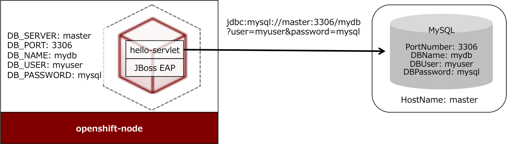

# hello-servlet

このサンプルは、JBoss Quick Start のHelloworld サーブレットを少しだけ改造して、DBから取得した値を出力するようにしています。
DB接続はDriverManagerを利用してConnectionを作成して行っています。DataSourceの登録は行っていません。


## 仕組み

JDBC URL を構成する、DBサーバホスト名、DBサーバポート番号、DB名、DBユーザ名、DBパスワードはコンテナに環境変数として設定します。
アプリケーションは、DBに接続する際に環境変数からこれらの値を取得して利用します。

JBoss EAP では、JDBC DriverをModuleとして登録することができますが、この方法を取る場合はstiのサブコマンド(assemble)を書く必要があります。
ここでは、mavenのdependencyでMySQLのJDBC Driverを指定して、WARファイルにJDBC Driverが含まれるようにしています。

## DBサーバの準備
https://github.com/akubicharm/hello-php/blob/demo/EXTERNALDB_USING_ENVIRONMENT_VARABLES.md 参照

|名称|値|
|---|---|
|DBポート|3306|
|DBサーバ|master|
|DB名|mydb|
|DBユーザ|myuser|
|DBパスワード|mysql|


## サーブレットのデプロイ

### 1.プロジェクトの作成
```
oc new-project hello-servlet
```

### 2.Secrets の登録
https://github.com/akubicharm/openshift-playground/blob/master/templates/eap/eap-app-secret.json を利用して secrets を登録します。
```
oc create -f eap-app-secret.json
```

### 3.アプリケーションの作成
eap6-basic-sti テンプレートを指定して、アプリケーションを作成します。

|パラメータ名|値|
|---|---|
|APPLICATION_NAME|eap-app|
|GIT_URL|https://github.com/akubicharm/openshift-playground.git|
|GIT_REF|master|
|GIT_CONTEXT_DIR|app/hello-servlet|

### 4.環境変数の設定
```
oc env dc <Deployment Config Name> -e DB_HOST=master -e DB_PORT=3306 -e DB_USER=myuser -e DB_PASSWORD=mysql -e DB_NAME=mydb
```

### 5.動作確認
`http://eap-app-http-route-hello-servoet.apps.cloud/hell-servlet/HelloWorld` にアクセスし、DB から取得した値が表示されていることを確認します。

# 参考
OpenShiftのServiceとEndpointを利用して外部のDBに接続する方法は<https://github.com/akubicharm/hello-php/blob/demo/EXTERNALDB.md>を参照。

