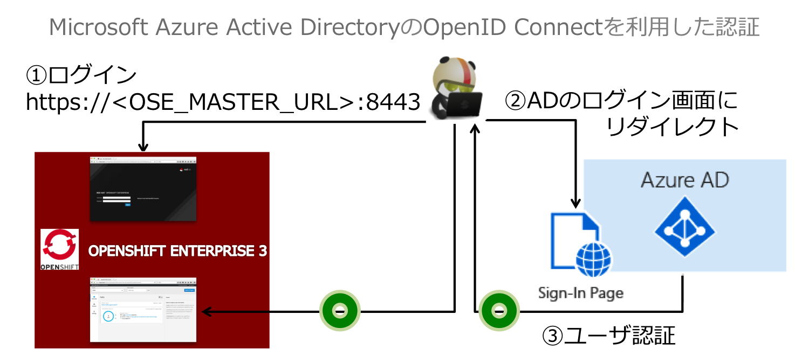
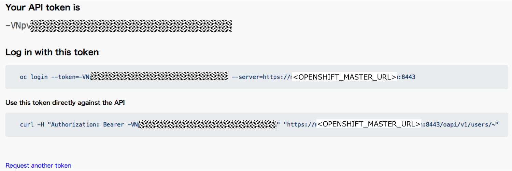
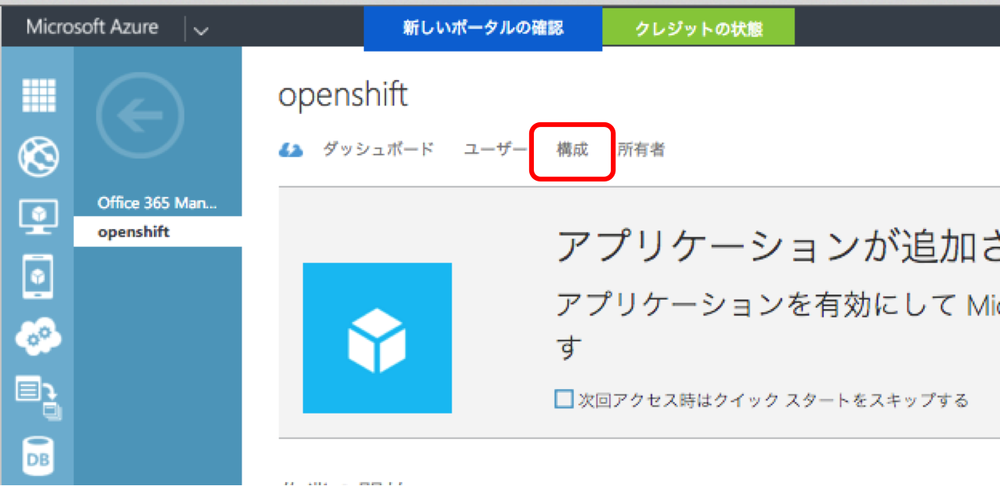

# OpenShift v3 の認証を Windows Azure Active Directory で実現

## はじめに
OpenShiftは複数の認証方式を指定して利用することができます。ここではMicrosoft Azure Active Directoryを利用したOpenID Connectでの認証の仕組みの設定方法をご紹介します。

## 前提条件
* OpenShift v3がインストール済みであること
* OpenShiftのマスタサーバからMicrosoft Azureに接続できること

## 今回の構成
クラウド上に構築された OpenShift Enterpise v3.1 と、Micosoft Azure Active Directory を連携させます。
相互に通信できる必要があるため、どちらもPublicなIPアドレスが付与されている必要があります。

`OPENSHIFT_MASTER_URL` は実際の OpenShift の MasterURL を示します。


## ログイン仕組み

1. ユーザが OpenShift のマスターサーバへアクセス
- Microsoft Azure Active Directoryのログイン画面へリダイレクト
- Microsoft Azure Activve Directoryにてユーザ認証しトークンを付与
- OpenShiftマスタサーバへのログイン完了




CLI でログインする場合は、`--token`オプションを否定する必要があります。
ブラウザで `https://<OPENSHIFT_MASTER_URL>:8443/oauth/token/request` にアクセスし、Token を確認します。
Log in with this Token に表示された通りにコマンドを入力すると、CLIでのログインも可能になります。



## ログインしているところの動画
https://youtu.be/0hGVXSUMIwc

---
## Microsoft Azure Active Directory の準備

###1.Microsoft AzureのポータルでActive Directoryを新規構築

新規リソース作成で、「セキュリティ + ID」 ==> 「Active Directory」を選択します。


###2.ディレクトリ追加
OpenShiftのユーザ認証に利用するDirectoryを作成します。


|名称|値|備考|
|---|---|---|
|ディレクトリ|新しいディレクトリの作成||
|名前|ose|ディレクトリの名前を入力します|
|ドメイン名|komizo|<サブドメイン名>.onmicrosoft.com が一意となるサブドメイン名を入力します|
|国/リージョン|日本|データセンタの国/リージョンを指定します。作成後に変更できないので要注意！|


###3.アプリケーションの追加
ディレクトリを選択し、画面下部の「追加」ボタンをクリックして、アプリケーション追加のウィザードを開始します。

####ウィザード1: 実行する作業を選択してください
「組織で開発中のアプリケーションを追加」を選択します。

####ウィザード2: アプリケーション情報の指定

|名称|値|
|---|---|
|名前|openshift|
|種類|WEBアプリケーションやWEB API|

####ウィザード3: アプリケーションのプロパティ

|名称|値|
|---|---|
|サインオンURL|https://OPENSHIFT_MASTER_URL:8443|OpenShift管理サーバのログインURL
|アプリケーションID/URI|https://OPENSHIFT_MASTER_URL:8443


###4.ユーザ追加
ユーザ追加のウィザードでユーザを追加します。

####ウィザード1: このユーザに関する情報の入力

|名称|値|
|---|---|
|ユーザの種類|組織内の新しいユーザ|
|ユーザ名|demouser01|


####ウィザード2: ユーザープロファイル

|名称|値|
|---|---|
|名|user01|
|姓|demo|
|表示名|demouser01|
|ロール|ユーザ|


####ウィザード3: 一時パスワードの取得
「作成」ボタンをクリックし、表示されたパスワードの文字列をコピーしておきます。


####アプリケーションの割り当て
Active Directory管理下のアプリケーションOpenShiftを作成したdemouser01に割り当てます。


---
## OpenShiftの設定
###5.Microsoft Azure Active Directoryの接続情報の確認
OpenShiftの認証機能を設定するための情報を、Microsoft Azure Active Directoryの構成画面で確認します。

####(1)ディレクトリの一覧から、OpenShiftのディレクトリを選択
OpenShiftの認証用に作成した「ose」というディレクトリを選択します。


####(2)アプリケーションビューを選択


####(3)アプリケーション一覧からOpenShiftを選択
アプリケーション一覧から「OpenShift」を選択します。


####(4)構成ビューを選択



####(5)クライアントIDとキーの確認
OpenShiftの認証設定に必要なクライアントID(clientID)とキー(clientSecret)を確認します。
キーは初期状態では生成されていないので、時間の設定をしてキーを生成します。


####(6)エンドポイントの確認
画面下部の「エンドポイントの表示」をクリックし、エンドポイントビューを表示します。　


####(7)OAUTH2.0トークンエンドポイントと承認エンドポイントを確認
OpenShiftの認証設定に必要な、OAuth2.0トークンエンドポイント(urls.token)とOAuth2.0認証エンドポイント(urls.authorize)を確認します。


###6.OpenShiftの認証設定の変更
認証方式の変更はマスターサーバの `/etc/origin/master-config.yaml`を編集します。
編集後、`systemctl restart atomic-openshift-master` で、再起動します。


```
oauthConfig:
  assetPublicURL: https://OPENSHIFT_MASTER_URL:8443/console/
  grantConfig:
    method: auto
  identityProviders:
  - name: my_ad_connect
    challenge: false
    login: true
    mappingMethod: claim
    provider:
      apiVersion: v1
      kind: OpenIDIdentityProvider
      clientID: ********-****-****-****-************    ← Active Directory構成情報の「クライアントID」
      clientSecret: ******************************************** ← Active Directory構成情報の「キー」
      claims:
        id:
        - sub
        preferredUsername:
        - preferred_username
        name:
        - name
        email:
        - email
      urls:
        authorize: https://login.microsoftonline.com/<Object ID>/oauth2/authorize ← Active Directoryエンドポイントの「OAUTH2.0承認エンドポイント」
        token: https://login.microsoftonline.com/<Object ID>/oauth2/token ← Active Directoryエン>ドポイントの「OAUTH2.0トークンエンドポイント」
  masterPublicURL: https://OpenShift Master Server URL:8443
```

#参考
[1] https://azure.microsoft.com/ja-jp/documentation/articles/active-directory-application-objects/
[2] https://azure.microsoft.com/ja-jp/documentation/articles/active-directory-authentication-scenarios/
[3] http://openid-foundation-japan.github.io/rfc6750.ja.html

#用語説明
* クライアントID
  アプリケーションの登録時にAzure ADによって生成されるアプリケーションのIDです。認証コードまたはトークンを要求すると、認証時にクライアントIDとキーがAzureADに送信されます。 

* キー
  Web APIを呼び出すためにAzure ADに対して認証する時に、クライアントIDと共に送信されるキーです。

* Bearer Token（署名なしトークン）
  セキュリティトークン。トークンを所有する任意のパーティ（持参人=beaer)は、「トークンを所有している」という条件を満たしさせすればそのトークンを利用することができる。署名なしトークンを利用する際、持参人は、暗号鍵の所持を照明(proof-of-prosession)をするよう要求されない。

* JWT (JSON Web Token)


