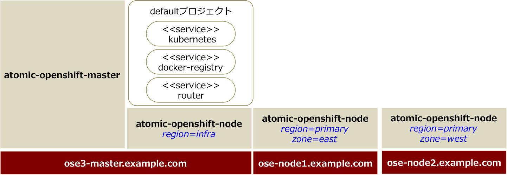

# はじめに

## 参考資料
https://access.redhat.com/documentation/en/openshift-enterprise/3.1/installation-and-configuration/installation-and-configuration

## インストール作業で必要な前提知識
* subscription-manager
* yum
* git
* ansible
* systemd

## インストールする構成
* ose3-master.example.com 192.168.1.101
* ose3-node1.example.com  192.168.1.201
* ose3-node2.example.com  192.168.1.202

※インストールガイドでは、Master サーバをインフラ用 Node としても利用しています。

このインストール手順書では、 Quick Install を利用して インストールすることを前提としています。
この方式でインストールした場合、ユーザ認証は設定されませんので、後から設定します。
認証方式の変更は https://access.redhat.com/documentation/en/openshift-enterprise/3.1/installation-and-configuration/chapter-5-configuring-authentication を参照してください。

## OS インストール
OpenShift 3 のインストールには Red Hat Enterprise Linux 7.1 以上が必要です。
Vagrantのboxイメージが https://access.redhat.com/downloads/content/293/ver=2/rhel---7/2.0.0/x86_64/product-downloads から取得できるので、これを利用すると論理ボリュームの設定がすでにされたイメージが使えるので、便利です。

---
# インストール

インストール対象の全てのサーバで実施します。

## 環境確認
* github との接続

 インストール中に、ImageStream（OpenShiftで利用できるアプリケーションテンプレート）の取得の過程で github.com に接続しますので、マスタサーバから github.com へ接続可能であることを確認してください。

* hosts ファイル

 名前解決するため、マスタサーバ、ノードサーバの /etc/hosts の設定を確認してください

## Subscriptionの有効化

* 実行ユーザ: root
* 実行サーバ: Master、Node 全て

    [root@ose3-master ~]# subscription-manager register --username=<RHN ユーザ名> --password=<RHNパスワード>
    [root@ose3-master ~]# subscription-manager attach --pool <RHN プールID>

    [root@ose3-master ~]# subscription-manager repos --disable="*"
    [root@ose3-master ~]# subscription-manager repos \
         --enable=rhel-7-server-rpms \
         --enable=rhel-7-server-extras-rpms \
         --enable=rhel-7-server-optional-rpms \
         --enable=rhel-7-server-ose-3.1-rpms

## パッケージのインストール
* 実行ユーザ：root
* 実行サーバ：Master

## 必要なパッケージをインストール
    [root@ose3-master ~]# yum install wget git net-tools bind-utils iptables-services bridge-utils bash-completion

## パッケージのアップデート
    [root@ose3-master ~]# yum update

## OpenShift のパッケージインストール
    [root@ose3-master ~]# yum install atomic-openshift-utils

# Docker のインストール
* 実行ユーザ: root
* 実行サーバ: Master

## docker パッケージインストール
    [root@ose3-master ~]# yum install docker

## /etc/sysconfig/docker の編集
OPTIONSプロパティで、`insecure-registory` として利用できるサブネットを指定

File = /etc/sysconfig/docker

    OPTIONS=--selinux-enabled --insecure-registry 172.30.0.0/16

## doker の再起動
    [root@ose3-master ~]# systemctl restart docker

## docker のステータス確認
    [root@ose3-master ~]# systemctl status docker
    docker.service - Docker Application Container Engine
       Loaded: loaded (/usr/lib/systemd/system/docker.service; enabled)
       Active: active (running) since 木 2015-07-02 21:03:20 JST; 1h 26min ago
         Docs: http://docs.docker.com
     Main PID: 1152 (docker)
       CGroup: /system.slice/docker.service
               └─1152 /usr/bin/docker -d --selinux-enabled --insecure-registry 172.30.0.0/16 --add-registry registry.access.redhat.com

## DockerStorageの設定
検証環境の構築では、必須ではないのでここでは割愛します。
Docker Storageの設定をする場合は、マニュアルを参照してください。

---
# 公開鍵の設定
インストールを実行するユーザで公開鍵を作成します。
* 実行ユーザ: vagrant
* 実行サーバ: Master サーバ

##  公開鍵の作成

    [vagrant@ose3-master ~]# ssh-keygen
    Generating public/private rsa key pair.
    Enter file in which to save the key (/home/vagrant/.ssh/id_rsa):  ← リターンを入力
    Created directory '/home/vagrant/.ssh'.
    Enter passphrase (empty for no passphrase):  ← リターンを入力
    Enter same passphrase again:  ←  リターンを入力
    Your identification has been saved in /home/vagrant/.ssh/id_rsa.
    Your public key has been saved in /home/vagrant/.ssh/id_rsa.pub.
    The key fingerprint is:
    72:7e:9c:61:7a:f1:af:f5:c6:ad:7d:c0:b9:c7:77:a3 vagrant@ose3-master
    The key's randomart image is:
    +--[ RSA 2048]----+
    |                 |
    |                 |
    |                 |
    |                 |
    |      . S +  . . |
    |       + + =  +  |
    |        o = . .=.|
    |         o   o.+X|
    |            .E++B|
    +-----------------+

## 公開鍵の配布
    [vagrant@ose3-master ~]# for host in ose3-master.example.com \
     ose3-node1.example.com \
     ose3-node2.example.com; \
    do ssh-copy-id -i ~/.ssh/id_rsa.pub $host; \
     done

## インストール設定ファイルの作成
インストールを実行するユーザのホームディレクトリの配下にインストール設定用のファイルを準備しておくと、簡単にインストールができます。
[~/.config/openshift/installer.cfg.yml]

    version: v1
    variant: openshift-enterprise
    variant_version: 3.1
    ansible_ssh_user: vagrant
    ansible_log_path: /tmp/ansible.log
    hosts:
    - ip: 192.168.1.101
      hostname: master
      public_ip: 192.168.1.101
      public_hostname: ose-master.example.com
      master: true
      node: true
      containerized: true
      connect_to: 192.168.1.101
    - ip: 192.168.1.201
      hostname: node1
      public_ip: 192.168.1.201
      public_hostname: ose-node1.example.com
      node: true
      connect_to: 192.168.1.201
    - ip: 192.168.1.202
      hostname: node2
      public_ip: 192.168.1.202
      public_hostname: ose-node2.example.com
      node: true
      connect_to: 192.168.1.202

## インストール
    [vagrant@ose3-master ~]# atomic-openshift-installer -u install

## ノードの確認
    [vagrant@ose3-master ~]# oc get nodes
    NAME                LABELS                                              STATUS                     AGE
    master.example.com  kubernetes.io/hostname=192.168.1.101,region=infra   Ready,SchedulingDisabled   10h
    node1.example.com   kubernetes.io/hostname=192.168.1.201                Ready                      10h
    node2.example.com   kubernetes.io/hostname=192.168.1.202                Ready                      10h

## ユーザ認証方式の変更
クイックインストールの場合は、ユーザ認証方式が設定されず deny_all になっているので、誰も使えません。HTPasswd認証ができるように変更します。

変更前

    oauthConfig:
      assetPublicURL: https://ose-master.example.com:8443/console/
      grantConfig:
        method: auto
      identityProviders:
      - name: deny_all
        challenge: True
        login: True
        provider:
          apiVersion: v1
          kind: DenyAllPasswordIdentityProvider

変更後

    oauthConfig:
      assetPublicURL: https://ose-master.example.com:8443/console/
      grantConfig:
        method: auto
      identityProviders:
      - name: htpasswd_auth  ←ここを編集
        challenge: True
        login: True
        provider:
          apiVersion: v1
          kind: HTPasswdPasswordIdentityProvider  ←ここを編集
          file: /etc/origin/openshift-passwd      ←ここを追加

---
# DNS設定
Master サーバでは、内部的に利用するべつのDNSサーバが稼働しているので、Master サーバ以外でネーミングサービスを動かしてください。
## 参考
https://github.com/openshift/training/blob/master/beta-4-setup.md#appendix---dnsmasq-setup

---
# Docker RegistryとRouterの作成
STIビルドなどで作成した Docker Image を保持するためのDocker Registoryとルーティング機能を提供するHAProxyのデプロイします。

* 実行ユーザ: vagrant
* 実行サーバ: Master

## スケジューリングの有効化
インストール直後は、masterサーバはスケジューリング不可（Podのデプロイ不可）になっているので、スケジューリング可能にします。
    [vagrant@ose3-master ~]# oadm manage-node master --schedulable=true

## registry 作成

    [vagrant@ose3-master ~]# htpasswd /etc/origin/openshift-htpasswd reguser
    [vagrant@ose3-master ~]# oadm policy add-role-to-user system:registry reguser
    [vagrant@ose3-master ~]# sudo mkdir -p /registry
    [vagrant@ose3-master ~]# sudo oadm registry --selector="region=infra" --config=/etc/origin/master/admin.kubeconfig --credentials=/etc/origin/master/openshift-registry.kubeconfig --images='registry.access.redhat.com/openshift3/ose-${component}:${version}' --replicas=1 --service-account=registry --mount-host=/registry

レプリカ数を1にして、Podをデプロイします。
    [vagrant@ose3-master ~]# oc scale rc docker-registry-1 --replicas=1 

Podのステータスが Running になっていることを確認します。
    [vagrant@ose3-master ~]# oc get pods
    NAME                      READY     STATUS    RESTARTS   AGE
    docker-registry-1-gp1qt   1/1       Running   0          10h

デプロイ用のPodを確認して、削除します。
    [vagrant@ose3-master ~]# oc get pods |grep deploy
    [vagrant@ose3-master ~]# oc delete pod docker-registry-1-deploy

## Router の作成
    [vagrant@ose3-master ~]# sudo oadm router   --selector="region=infra" --config=/etc/origin/master/admin.kubeconfig --credentials=/etc/origin/master/openshift-router.kubeconfig   --images='registry.access.redhat.com/openshift3/ose-${component}:${version}' --replicas=1 --service-account=router

レプリカ数を1にして、Podをデプロイします。
    [vagrant@ose3-master ~]# oc scale rc router-1 --replicas=1

PodのステータスがRunningになっていることを確認します。

    [vagrant@master ~]$ oc get pods
    NAME                      READY     STATUS    RESTARTS   AGE
    docker-registry-1-gp1qt   1/1       Running   0          10h
    router-1-4dfym            1/1       Running   0          10h

デプロイ用のPodを確認して、削除します。
    [vagrant@ose3-master ~]# oc delete pod router-1-deploy

# アプリケーションドメインのデフォルト値変更
アプリケーションのドメイン名の接尾辞が apps.example.com となるように変更します。

[/etc/origin/master/master-config.yaml]

変更前

    routingConfig:
      subdomain:  ""

変更前

    routingConfig:
    subdomain:  "apps.example.com"

    [vagrant@ose3-master ~]#

