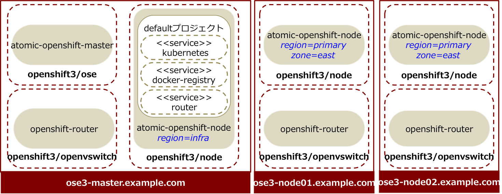

# はじめに

## 参考資料
https://access.redhat.com/documentation/en/openshift-enterprise/3.1/installation-and-configuration/installation-and-configuration

## インストール作業で必要な前提知識
* subscription-manager
* yum
* git
* ansible
* systemd
* docker

## インストールする構成
* ose3-master.example.com 192.168.1.120
* ose3-node01.example.com  192.168.1.121
* ose3-node02.example.com  192.168.1.122

破線で囲ったプロセスは、すべてコンテナ。

※本インストールガイドでは、Master サーバをインフラ用 Node としても利用しています。

このインストール手順書では、 OpeShiftのMasterサーバ、NodeサーバをDockerコンテナとして Advanced Install でインストールすることを前提としています。

※もちろん、クイックスタートでもインストール可能です。

## OS インストール
OpenShift 3 のインストールには Red Hat Enterprise Linux 7.1 以上が必要です。
Vagrantのboxイメージが https://access.redhat.com/downloads/content/293/ver=2/rhel---7/2.0.0/x86_64/product-software から取得できるので、これを利用すると論理ボリュームの設定がすでにされたイメージが使えるので、便利です。

注意：
Red Hat Container Development Kit の box イメージは、kubernetes のパッケージがインストール済みであるため、OpenShift のクイックインストールが失敗します。
最初に、kubernetes-client, kubernetes-master, kubernetes-node, kubernetes パッケージを削除してください。

---
# 公開鍵の設定
インストールを実行するユーザで公開鍵を作成します。
* 実行ユーザ: vagrant
* 実行サーバ: Master サーバ

以降の作業をマスターサーバから ssh で実行するために、先に、公開鍵を配布します。

##  公開鍵の作成

    [vagrant@master ~]# ssh-keygen
    Generating public/private rsa key pair.
    Enter file in which to save the key (/home/vagrant/.ssh/id_rsa):  ← リターンを入力
    Created directory '/home/vagrant/.ssh'.
    Enter passphrase (empty for no passphrase):  ← リターンを入力
    Enter same passphrase again:  ←  リターンを入力
    Your identification has been saved in /home/vagrant/.ssh/id_rsa.
    Your public key has been saved in /home/vagrant/.ssh/id_rsa.pub.
    The key fingerprint is:
    72:7e:9c:61:7a:f1:af:f5:c6:ad:7d:c0:b9:c7:77:a3 vagrant@master
    The key's randomart image is:
    +--[ RSA 2048]----+
    |                 |
    |                 |
    |                 |
    |                 |
    |      . S +  . . |
    |       + + =  +  |
    |        o = . .=.|
    |         o   o.+X|
    |            .E++B|
    +-----------------+

## 公開鍵の配布
    [vagrant@master ~]# for host in ose3-master.example.com \
     ose3-node01.example.com \
     ose3-node02.example.com; \
    do ssh-copy-id -i ~/.ssh/id_rsa.pub $host; \
     done

---
# 必要なRPMパッケージのインストール

インストール対象の全てのサーバで実施します。

## 環境確認
* github との接続

 インストール中に、ImageStream（OpenShiftで利用できるアプリケーションテンプレート）の取得の過程で github.com に接続しますので、マスタサーバから github.com へ接続可能であることを確認してください。

* hosts ファイル

 名前解決するため、マスタサーバ、ノードサーバの /etc/hosts の設定を確認してください

* Docker イメージ
  OpenShiftのMasterサーバ、Nodeサーバそのものをコンテナ形式でインストールする場合には、以下のコンテナイメージを利用します。これらのイメージは https://registry.access.redhat.com/ から提供されています。
    * openshift3/ose
    * openshift3/node
    * openshift3/openvswitch
    * registry.access.redhat.com/rhel7/etcd

## Subscriptionの有効化

* 実行ユーザ: vagrant
* 実行サーバ: Master、Node 全て

    [vagrant@xxx ~]# sudo subscription-manager register --username $RHN_USERNAME --password=$RHN_PASSWORD
    [vagrant@xxx ~]# sudo subscription-manager attach --pool $RHN_POOLID
    [vagrant@xxx ~]# sudo subscription-manager repos --disable="*";
    [vagrant@xxx ~]# sudo subscription-manager repos \
    --enable=rhel-7-server-rpms \
    --enable=rhel-7-server-extras-rpms \
    --enable=rhel-7-server-optional-rpms \
    --enable=rhel-7-server-ose-3.1-rpms;" \
    done

## パッケージのインストール
* 実行ユーザ：vagrant
* 実行サーバ：Master、Node 全て

## 必要なパッケージのインストールとアップデート
    [vagrant@xxx ~]# sudo yum install -y wget git net-tools bind-utils iptables-services bridge-utils bash-completion;
    [vagrant@xxx ~]# sudo yum update -y;

## OpenShift のパッケージインストール
    [vagrant@xxx ~]# sudo yum install -y atomic-openshift-utils

---
# Docker のインストール
* 実行ユーザ: vagrant
* 実行サーバ: Master, Node

## docker パッケージインストール
    [vagrant@xxx~]# sudo yum install docker

## /etc/sysconfig/docker の編集
OPTIONSプロパティで、`insecure-registory` として利用できるサブネットを指定

File = /etc/sysconfig/docker

    OPTIONS=--selinux-enabled --insecure-registry 172.30.0.0/16

## doker の再起動
    [root@master ~]# systemctl restart docker

## docker のステータス確認
    [root@master ~]# systemctl status docker
    docker.service - Docker Application Container Engine
       Loaded: loaded (/usr/lib/systemd/system/docker.service; enabled)
       Active: active (running) since 木 2015-07-02 21:03:20 JST; 1h 26min ago
         Docs: http://docs.docker.com
     Main PID: 1152 (docker)
       CGroup: /system.slice/docker.service
               └─1152 /usr/bin/docker -d --selinux-enabled --insecure-registry 172.30.0.0/16 --add-registry registry.access.redhat.com

## ストレージ領域の確認
Master, Node, etcd などのコンテナの永続化データは /var/lib に保存されますので、十分な領域があることを確認してください。

---
# OpenShiftのインストール(コンテナ)

## Ansible のコンフィグファイルの作成
/etc/ansible/hosts ファイルに、Ansible Playbook ようの設定を記載します。
この構成では、冒頭の図のように Master x 1台、Node x 2台構成でインストールします。

認証方式はHTPasswdに設定します。

各Nodeにはラベルを設定します。
|ノード|ラベル|
|--|---|
|master|region=infra,zone=default|
|node01|region=primary,zone=east|
|node02|region=primary,zone=west|

    # Create an OSEv3 group that contains the masters and nodes groups
    [OSEv3:children]
    masters
    nodes
    
    # Set variables common for all OSEv3 hosts
    [OSEv3:vars]
    # SSH user, this user should allow ssh based auth without requiring a password
    ansible_ssh_user=root
    
    # If ansible_ssh_user is not root, ansible_sudo must be set to true
    #ansible_sudo=true
    
    deployment_type=openshift-enterprise
    
    # uncomment the following to enable htpasswd authentication; defaults to DenyAllPasswordIdentityProvider
    openshift_master_identity_providers=[{'name': 'htpasswd_auth', 'login': 'true', 'challenge': 'true', 'kind': 'HTPasswdPasswordIdentityProvider', 'filename': '/etc/origin/htpasswd'}]
    
    # subdomain
    osm_default_subdomain=app.example.com
    
    # host group for masters
    [masters]
    ose3-master.example.com openshift_hostname=ose3-master.example.com openshift_public_hostname=ose3-master.example.com openshift_ip=192.168.1.120 openshift_public_ip=192.168.1.120 containerized=true
    
    # host group for nodes, includes region info
    [nodes]
    ose3-master.example.com openshift_node_labels="{'region': 'infra', 'zone': 'default'}" openshift_ip=192.168.1.120 openshift_public_ip=192.168.1.120 containerized=true
    ose3-node01.example.com openshift_node_labels="{'region': 'primary', 'zone': 'east'}" openshift_ip=192.168.1.121 openshift_public_ip=192.168.1.121 containerized=true
    ose3-node02.example.com openshift_node_labels="{'region': 'primary', 'zone': 'west'}" openshift_ip=192.168.1.122 openshift_public_ip=192.168.1.122 containerized=true

          
## インストーラの実行
コンテナ形式でのインストールでは、docker コンテナにアタッチする必要があるため権限を持つユーザで実行する必要があります。ここでは root ユーザでインストールを実行します。

OpenShift インストールようのAnsible Playbook は、/usr/share/ansible/openshift-ansible ディレクトリに保存されています。

* 実行ユーザ: root
* 実行サーバ: Master

    [root@master ~]# ansible-playbook /usr/share/ansible/openshift-ansible/playbooks/byo/config.yml

## パスの設定
OpenShiftの CLI コマンドは、OpenShift Master を実行しているサーバの /usr/local/bin ディレクトリに保存されています。

    [root@master ~]# export PATH=/usr/local/bin:$PATH

## ノードの確認

    [root@master ~]# oc get nodes
    
    ================================================================================
    ATTENTION: You are running oc via a wrapper around 'docker run openshift3/ose'.
    This wrapper is intended only to be used to bootstrap an environment. Please
    install client tools on another host once you have granted cluster-admin
    privileges to a user. 
    See https://docs.openshift.com/enterprise/latest/cli_reference/get_started_cli.html
    =================================================================================
    
    NAME                      LABELS                                                                     STATUS                     AGE
    ose3-master.example.com   kubernetes.io/hostname=ose3-master.example.com,region=infra,zone=default   Ready,SchedulingDisabled   1h
    ose3-node01.example.com   kubernetes.io/hostname=ose3-node01.example.com,region=primary,zone=east    Ready                      1h
    ose3-node02.example.com   kubernetes.io/hostname=ose3-node02.example.com,region=primary,zone=west    Ready                      1h
    

## 確認
ここまでで、OpenShiftのインストールが完了しました。https://ose3-master.example.com:8443 にアクセスできるか確認してみましょう。

---
# インストール後の設定

### ユーザ登録
    [vagrant@master]# sudo htpasswd -b /etc/origin/openshift-passwd joe redhat

## Docker RegistryとRouterの作成
STIビルドなどで作成した Docker Image を保持するためのDocker Registoryとルーティング機能を提供するHAProxyのデプロイします。

* 実行ユーザ: vagrant
* 実行サーバ: Master

### スケジューリングの有効化
インストール直後は、masterサーバはスケジューリング不可（Podのデプロイ不可）になっているので、スケジューリング可能にします。

    [root@master]# oadm manage-node ose3-master --schedulable=true

### SECURITY CONTEXT constraint(SCC)の確認
OpenShift内部でDocker Imageを保持するレジストリと、アプリケーションの名前解決をするためのルーティング用のSCCがあることを確認します。
    [root@master ~]# oc export scc privileged
    users:
    - system:serviceaccount:default:registry
    - system:serviceaccount:default:router
  

### registry 作成
ここでは、Persistent Volume を使わずにマスターサーバのディレクトリをマウントする方式をとります。
Persistent Volume を利用する場合は、https://access.redhat.com/documentation/en/openshift-enterprise/3.1/installation-and-configuration/chapter-2-installing を参照してください。
Registoryがインフラ用ノードにデプロイされるように、　`--selector="region=infra"` と指定します。
ここで、NFSマウントする場合、ディレクトリのパーミッションを 777 に変更しないと、docker-build した Docker Image を push できません。

    [root@master ~]# mkdir -p /registry
    [root@master ~]# chmod 777 /registry
    [root@master ~]# oadm registry \
    --service-account=registry \
    --config=/etc/origin/master/admin.kubeconfig \
    --credentials=/etc/origin/master/openshift-registry.kubeconfig \ 
    --images='registry.access.redhat.com/openshift3/ose-${component}:${version}'  \
    --mount-host=/registry \
    --selector="region=infra" \ 
    --replicas=1 

Podのステータスが Running になっていることを確認します。

    [root@master ~]$ oc get pods
    NAME                      READY     STATUS    RESTARTS   AGE
    docker-registry-1-1xpqk   1/1       Running   0          25s

### Router の作成
dry-run で、見作成であることを確認後、Router を作成します。

    [root@master ~]# oadm router --dry-run \
    --credentials=/etc/origin/master/openshift-router.kubeconfig \
    --service-account=router

    [root@master ~]# oadm router \
    --credentials=/etc/origin/master/openshift-router.kubeconfig \
    --service-account=router \
    --selector="region=infra" \
    --config=/etc/origin/master/admin.kubeconfig \
    --images='registry.access.redhat.com/openshift3/ose-${component}:${version}' \
    --replicas=1

    password for stats user admin has been set to jWMAtUTkg6
    DeploymentConfig "router" created
    Service "router" created

最後に出力されているPasswordは、HAProxyの管理コンソールへアクセスするためのパスワードです。

PodのステータスがRunningになっていることを確認します。

    [vagrant@master ~]$ oc get pods
    NAME                      READY     STATUS    RESTARTS   AGE
    docker-registry-1-1xpqk   1/1       Running   0          13m
    router-1-638dq            1/1       Running   0          3m
