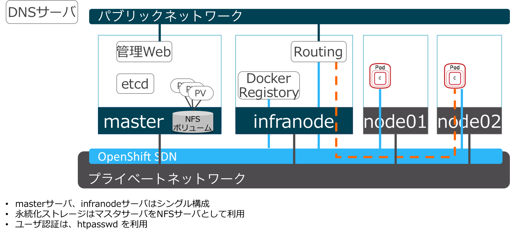

# インストール時に参照するドキュメント
|#|文書名|URL|
|---|---|---|
|[1]|INSTALL AND CONFIGURATION OPENSHIFT CONTAINER PLATFORM 3.5|https://access.redhat.com/documentation/en-us/openshift_container_platform/3.5/html/installation_and_configuration/|
|[2]|OpenShift on OpenStack Reference Architecture|https://github.com/redhat-openstack/openshift-on-openstack|

インターネット接続ができない状況でインストールする場合は、次の章を最初に確認してください。


参考資料[1] 2.7. DISCONNECTED INSTALL

インストール実施前には、次の章を必ず確認してください。

参考資料[1]<br>
2.2.Prerequisites<br>
2.3.Host Preparation<br>
2.6.Advanced Installation<br>
18.CONFIGUREING FOR OPENSTACK


# インストール準備

## インストール中にアクセスするサーバ
|#|名称|URL|
|---|---|---|
|1|Red Hat Container Catalog|registry.access.redhat.com|
|2|コンテンツ配信チャンネル|cdn.redhat.com|

## インストールする形式
**RPM** でのインストールとします。

PRMでパッケージをインストールして利用する方法とOpenShiftのMaster/Nodeをコンテナとしてデプロイする方法があります。

参考[1] 2.1.5. RPM vs Containerized

## インストール方法
**Advanced Install**とします。

Quick Install と Advancec Install がありますが、柔軟な設定を可能とするためAdvanced Installにて、Ansibleのインベントリファイルを準備してインストールする方法とします。

参考[1] 2.6. Advanced Installation

## 外部に接続できない場合の準備
OpenShiftのインストールは、YUMのリポジトリへのアクセスとRed Hat のコンテナリポジトリへのアクセスが必要となります。
ネットワーク接続されていない環境でインストールするためには、
  - YUMのリポジトリのキャッシュ
  - コンテナイメージのキャッシュ
を事前に準備してください。

参考資料[1] 2.7. DISCONNECTED INSTALL

# インストール
インストールは、Ansibleのインベントリファイルを作成してインストールする Advanced Install 形式とします。

Ansible のインベントリファイルは、参考資料[1]  2.6.4. Example Inventory Files の Singl Master and Multiple Node Inventory File を参考にしてください。

## 想定する環境
シンプルな検証環境として、Masterサーバ x 1、Infranode x 1, Node x 2 の構成とします。また、Persistent Storageには、MasterサーバをNFSサーバとして利用します。


Ansible PlaybookをMasterサーバで実行し、Master, Infranode, Node01, Node02をセットアップします。

OpenStackに構築する場合は、Master, Infranodeはクライアントからのアクセスを可能とするためフローティングIPが必要となります。

## インストールの流れ
1. ホスト準備
2. Subscriptionの有効化
3. 必要なパッケージのインストール
4. Inventoryファイルの作成
5. SSH Keyの配布
6. OpenShift インストール用のプレイブックの実行
7. インストールの確認


## 1. ホスト準備

### システム要件
Master/Nodeサーバでシステム要件が異なりますので、システム要件を確認してください。

参考資料[1] 2.2.1. System Requirements

### OpenShift以外で必要なサービス
OpenShiftにデプロイしたアプリケーションにクライアントからアクセスするためにDNSにワイルドカードのエントリが必要です。

参考資料[1] 2.2.2.1. DNS

## 2. Subscriptionの有効化
Subscriptionを登録し、パッケージを有効化します。

* 作業対象
 * Master, Infranode, Node01, Node02

参考資料[1] 2.3.2. Host Registragion

## 3. 必要なパッケージのインストール
OpenShiftのインストールに必要なパッケージや、Dockerをインストールします。

* 作業対象
 * Master, Infranode, Node01, Node02

参考資料[1] 2.3.3. Installing Base Package<br>
参考資料[1] 2.3.4. Instaling Docker

検証目的の場合は、Docker用のロジカルボリュームはなくても構いませんが、必要に応じてロジカルボリュームを作成してください。

参考資料[1] 2.3.5. Configuraing Docker Storage

## 4. Invetoryファイルの作成
/etc/ansible/hostsをOpenShiftのインストール用に編集します。
* 作業対象
 * Master

参考資料[1]  2.6.4. Example Inventory Files の Single Master and Multiple Node Inventory File

## 5. SSH Keyの配布
Ansibleのプレイブックの実行時にパスワード認証ではなく、鍵認証ができるように各サーバにAnsible Playbook実行ユーザの公開鍵を配布します。

参考資料[1] 2.3.6. Ensuring Host Access

* 作業対象
 * Master, Infranode, Node01, Node02

## 6. OpenShiftインストール用プレイブックの実行
Ansibleのプレイブックを実行し、OpenShiftのインストールを実施します。

* 作業対象
 * Master

参考資料[1] 2.6.5. Running the Advanced installation_and_configuration

## 7. インストールの確認
### Node の確認
* 作業対象
 * Masterサーバ
* 作業ユーザ
 * root

Masterサーバにて、Nodeの状況を確認します。　
```
oc get nodes
```
### プロセスの確認
* Master
```
systemctl status atomic-openshift-master
systemctl status atomic-openshift-node
```
* Infranode, Node01, 02
```
systemctl status atomic-openshift-node
```


参考資料[1] 2.6.6. Verifying the Installation
